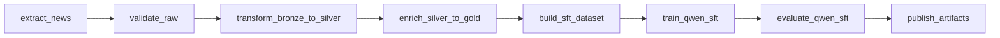

# Отчёт: пайплайн Big Data — Airflow, слои данных, SFT на arXiv

## 1. Цель работы

Спроектировать и реализовать сквозной **оркестрируемый пайплайн** от загрузки сырых данных до подготовки датасета и **микро-донастройки (SFT)** небольшой языковой модели на текстах препринтов с **arXiv**. Оркестрация выполняется в **Apache Airflow**; обучение — через **Hugging Face Transformers** и **PyTorch** (CUDA при наличии GPU).

Идея курсового контракта данных: **bronze → silver → gold**, затем построение **SFT JSONL**, обучение, отчёт по метрикам и **публикация** сводного манифеста артефактов.

---

## 2. Краткое описание решения

| Компонент | Назначение |
|-----------|------------|
| **Docker Compose** | PostgreSQL (метаданные Airflow), **airflow-init**, **scheduler**, **webserver**; общий образ на базе `apache/airflow:2.9.3-python3.11` с PyTorch (CUDA 12.1) и библиотеками HF. |
| **DAG `news_llm_pipeline`** | Последовательность задач: извлечение из arXiv API, валидация, нормализация, обогащение, SFT-датасет, обучение Qwen, оценка по train loss, публикация манифеста. |
| **`scripts/sft.py`** | Вынесенное обучение: загрузка модели, токенизация, `Trainer`, сохранение чекпоинта и `metrics.json`. |

Слой **Spark** в текущей версии не выносится в отдельный кластер: преобразования bronze→silver→gold реализованы **на Python** внутри Airflow (тот же контракт слоёв, упрощение для отладки и курса).

---

## 3. Архитектура пайплайна



1. **extract_news** — HTTP-запросы к arXiv API, сохранение сырого JSONL в bronze.  
2. **validate_raw** — проверка полей и типов, отчёт о доле брака.  
3. **transform_bronze_to_silver** — нормализованная схема (title, body, метаданные).  
4. **enrich_silver_to_gold** — дополнительные поля (в т.ч. эвристические «обогащения» для downstream).  
5. **build_sft_dataset** — JSONL с полем `messages` (user/assistant) под **chat template** Qwen.  
6. **train_qwen_sft** — subprocess: `python scripts/sft.py …`.  
7. **evaluate_qwen_sft** — чтение `metrics.json`, отчёт с loss и грубой perplexity.  
8. **publish_artifacts** — единый `PIPELINE_MANIFEST.json` со ссылками на пути артефактов.

---

## 4. Технологический стек

- **Python 3.11**, **Apache Airflow 2.9.3** (LocalExecutor).  
- **PostgreSQL 15** — backend метаданных Airflow.  
- **PyTorch** (wheel **cu121** в образе), **transformers**, **datasets**, **accelerate**, **sentencepiece**.  
- Модель по умолчанию: **`Qwen/Qwen2.5-0.5B-Instruct`** (переопределяется переменной окружения).  
- Данные: **JSONL**, каталоги по `process_date` (логическая дата запуска DAG).

---

## 5. Структура репозитория

```
Big_Data_cource/
├── docker-compose.yml    # Сервисы Airflow + Postgres, env, GPU у scheduler (опционально)
├── Dockerfile.airflow    # Расширение образа Airflow: torch cu121, HF-стек, кэш pip (BuildKit)
├── dags/
│   └── news_llm_pipeline.py
├── scripts/
│   └── sft.py            # Обучение (Trainer)
├── data/                 # Артефакты пайплайна (в .gitignore)
├── logs/                 # Логи Airflow (в .gitignore)
└── plugins/
```

---

## 6. Сборка и запуск

Требования: **Docker** и **Docker Compose**, для GPU у scheduler — **NVIDIA Container Toolkit** и драйвер NVIDIA.

```bash
# Сборка (желательно BuildKit для кэша pip между пересборками)
set DOCKER_BUILDKIT=1
docker compose build

docker compose up -d
```

Веб-интерфейс: **http://localhost:8080**  
Учётная запись по умолчанию (из `airflow-init`): **admin** / **admin**.

Дальше: включить DAG **`news_llm_pipeline`**, при необходимости **Trigger DAG** (для быстрого прогона можно передать конфиг `{"scale": "smoke"}` при ручном запуске, если не задано в окружении).

---

## 7. Конфигурация

### 7.1. Объём выгрузки arXiv (`scale`)

Приоритет: **JSON при триггере** → **`NEWS_PIPELINE_SCALE`** в окружении → **`params["scale"]`** в DAG → по умолчанию **`full`**.

| Режим   | Пример объёма |
|---------|----------------|
| `smoke` | мало записей, без пауз между страницами |
| `test`  | средний сэмпл |
| `full`  | до двух страниц API с паузой (аккуратно к arXiv) |

### 7.2. Обучение (SFT)

| Переменная | Смысл |
|------------|--------|
| `SFT_MODEL_NAME` | Идентификатор модели на Hugging Face (по умолчанию задаётся в `scripts/sft.py`). |
| `SFT_MAX_STEPS` | Явное число шагов Trainer (иначе лимиты по `scale`: smoke 50, test 120, full 300). |
| `SFT_BATCH_SIZE` | Размер микробатча (строка, например `"1"` или `"2"`). |
| `SFT_LEARNING_RATE` | Опционально; если не задано — значение по умолчанию в `sft.py`. |

### 7.3. Кэш моделей (Hugging Face)

В задаче **`train_qwen_sft`** для subprocess выставляются **`HF_HOME`** и **`TRANSFORMERS_CACHE`** под каталог проекта:

- в контейнере: **`/opt/airflow/project/data/.hf_cache`**  
- на хосте: **`./data/.hf_cache`**

Так кэш скачанных весов сохраняется между запусками и не засоряет домашний каталог пользователя внутри контейнера.

### 7.4. GPU

В `docker-compose.yml` у **`airflow-scheduler`** заданы **`shm_size`** и блок **`deploy.resources.reservations.devices`** для NVIDIA. На машине без GPU этот блок нужно **отключить**, иначе Compose может не поднять сервис. При наличии **RTX 3060** и корректно настроенного toolkit обучение использует **CUDA** (`torch.cuda.is_available()`), иначе выполняется на **CPU** (дольше, но пайплайн сохраняется).

---

## 8. Выходные данные (артефакты)

Корень данных: **`PROJECT_DIR/data`** в контейнере → **`./data`** на хосте.

| Путь (шаблон) | Содержимое |
|---------------|------------|
| `data/bronze/news/process_date=<ds>/` | Сырой и валидированный JSONL, отчёт валидации |
| `data/silver/news/process_date=<ds>/` | Silver JSONL |
| `data/gold/news/process_date=<ds>/` | Gold JSONL |
| `data/sft/news/process_date=<ds>/sft_train.jsonl` | Датасет для SFT (`messages`) |
| `data/models/qwen_sft/process_date=<ds>/` | Чекпоинт, `metrics.json`, `train_manifest.json` |
| `data/eval/qwen_sft/process_date=<ds>/eval_report.json` | Отчёт после обучения |
| `data/publish/process_date=<ds>/PIPELINE_MANIFEST.json` | Сводка путей ко всем основным артефактам |

---

## 9. Как убедиться, что пайплайн выполняется

1. В UI Airflow: DAG run в колонке **Runs**, в **Grid** / **Graph** смена состояний задач (**running** → **success** / **failed**).  
2. Лог **конкретной задачи** (особенно `train_qwen_sft`) — основной вывод обучения и HF.  
3. Лог **`airflow-scheduler`**: события постановки задач в очередь и завершения (короткие шаги видны сразу; обучение может долго не писать в scheduler).  
4. Появление и обновление файлов в **`./data/...`** по дате `process_date`.

---

## 10. Заключение

Реализован рабочий **сквозной пайплайн** под управлением **Airflow**: от загрузки метаданных препринтов с arXiv до **SFT малой модели Qwen2.5** и фиксации результатов в **манифесте**. Окружение упаковано в **Docker**; параметры объёма данных и обучения вынесены в **переменные окружения** и конфигурацию запуска DAG, что упрощает повторяемые эксперименты и отладку.
